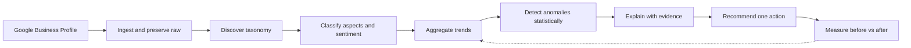
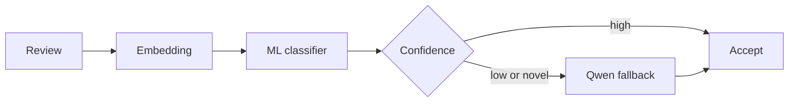
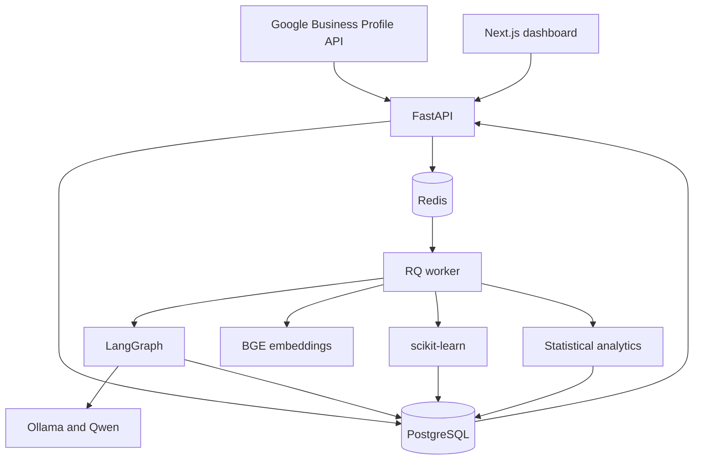

<div align="center">

<picture>
  <source media="(prefers-color-scheme: dark)" srcset="docs/assets/logo-dark.svg">
  
</picture>

### An AI customer intelligence platform that turns Google reviews into an operating signal.

[](LICENSE)
[](https://www.python.org/)
[](https://fastapi.tiangolo.com/)
[](https://nextjs.org/)
[](https://www.postgresql.org/)
[](https://python-rq.org/)
[](https://langchain-ai.github.io/langgraph/)
[](https://ollama.com/)


</div>

ReviewSignal AI is an internal customer intelligence platform built for **Maple Photo Imaging**, a
real small business. It continuously ingests Google Business Profile reviews, discovers a taxonomy
*from the customers' own language* rather than from a fixed list of categories, labels every review
at the aspect level with its own sentiment and evidence, and detects when a theme starts moving
against its historical baseline.

The point is not to summarise reviews. It is to close a loop: notice a change, explain it with
evidence, recommend one action, then measure whether the underlying signal actually improved.

> [!NOTE]
> **Milestone 0 — Project Foundation.** The repository, local runtime, database schema, job
> lifecycle, and quality gates are built and verified. Review ingestion, taxonomy discovery, and
> classification are specified but **not yet implemented** — they begin with Phase 0. Every section
> below marks what exists today.

---

## The feedback intelligence loop



Statistics decide *whether* something is unusual. The language model only explains a pattern that
has already been verified, and recommends against it. That ordering is deliberate: it is what keeps
recommendations grounded in observed data instead of fluent invention.

---

## What ReviewSignal does

### Ingest

- Backfills the complete Google review history, then syncs daily
- Preserves the raw source payload alongside normalised columns, so any analysis can be recomputed
- Stays idempotent across syncs via stable source identifiers
- Sits behind a source-agnostic adapter, so Yelp or survey data can join later without touching the core

### Understand

- Builds a **hierarchical taxonomy from the review corpus** — no hard-coded business categories
- Assigns zero, one, or many aspects per review, each with independent sentiment and confidence
- Attaches a supporting quote as evidence for every label
- Never exposes or persists hidden model reasoning

### Detect

- Compares each period against a relevant historical baseline rather than a fixed threshold
- Uses **low-volume-aware** logic with minimum support, because a small business gets few reviews
- Raises an alert only when the evidence is strong enough to act on

### Act

- Generates insights tied to observable signals, with facts kept separate from suggestions
- Tracks each insight through `new → monitoring → resolved`, with operator notes and manual override
- Estimates before-versus-after impact once an action is taken
- Communicates uncertainty when evidence is weak instead of issuing a confident prescription

### Stay consistent

- Every taxonomy change creates a **new immutable version** with a recorded diff
- Historical reviews are reclassified after an accepted change, so time series stay comparable
- Rollback to any prior version is supported
- Previous analyses are retained rather than overwritten, so any label can be audited

---

## How it works

### LLM-powered, not LLM-dependent

The reasoning model is reserved for work that genuinely needs judgment. Everything else is ordinary
software, statistics, or a small classifier — which is cheaper, faster, and far easier to test.

| Handled by Qwen via Ollama | Handled by code, ML, or statistics |
| --- | --- |
| Taxonomy generation and refinement | Review syncing and persistence |
| Difficult or novel classification | Routine classification via embeddings |
| Grounded explanation of a verified anomaly | Trend aggregation and dashboard metrics |
| Action recommendation | Anomaly detection itself |

### Classification escalates only when it must



### PostgreSQL is the system of record

Fourteen tables carry raw reviews, versioned taxonomies, per-aspect analyses, anomalies, insights,
actions, and the full job and model-run audit trail. Invariants live in the database, not in
application code:

| Invariant | Enforced by |
| --- | --- |
| Exactly one active taxonomy version | Partial unique index on `status = 'active'` |
| Rating between 1 and 5 | `CHECK` constraint |
| Confidence between 0 and 1 | `CHECK` constraint |
| One record per source review | `UNIQUE` on `source_review_id` |
| Valid sentiment and status values | `CHECK` constraints |

A service-layer check would race under concurrent activation; a partial unique index cannot.

### Long work never blocks a request

Jobs are recorded in PostgreSQL and merely *transported* by Redis, so the queue backend stays
replaceable:

```text
queued → running → succeeded
                 → failed → (retries exhausted) → dead_letter
```

Failed jobs remain inspectable and can be requeued by hand.

---

## Architecture



A modular monolith with asynchronous AI workers — simple enough for one developer to maintain,
structured enough to grow. No Kubernetes, no microservices, no real-time streaming.

| Layer | Choice | Why |
| --- | --- | --- |
| API | FastAPI | The AI/ML stack is Python-first |
| Frontend | Next.js + TypeScript | Presentation only; never runs inference |
| Database | PostgreSQL 16 | Single source of truth |
| Queue | Redis + RQ | Simplest thing that survives a restart |
| AI workflow | LangGraph | Iterative, stateful taxonomy work |
| Runtime | Ollama + Qwen | Open-weight, local-first, no per-token cost |
| Deployment | Docker Compose → EC2 + RDS | One box until measurement says otherwise |

---

## Getting started

**Requires** Docker, [`uv`](https://docs.astral.sh/uv/), and Node 22+.

```bash
git clone git@github.com:Bruce1508/reviewSignal.git
cd reviewSignal
cp .env.example .env      # .env is gitignored and never committed
make install
make up                   # PostgreSQL + Redis
make migrate              # apply the baseline schema
```

Run the services in separate terminals:

```bash
make api      # http://localhost:8000/api/v1/health
make worker
make web      # http://localhost:3000
```

Verify the whole thing:

```bash
make check    # ruff · pyright · pytest · eslint · tsc · next build
```

The same command runs in CI on every pull request and on `main`
([`.github/workflows/check.yml`](.github/workflows/check.yml)), against service containers
matching `docker-compose.yml`.

> [!IMPORTANT]
> `make up` must be running before `make check`. The tests exercise **real PostgreSQL constraints**
> rather than mocking them — a test that passes because Python rejected a row would prove nothing
> about the database.

Ollama runs natively on macOS for hardware acceleration; point `OLLAMA_BASE_URL` at it. A
containerised Ollama is available via `docker compose --profile ollama up` where that is preferable.

<details>
<summary><b>All make targets</b></summary>

| Target | Does |
| --- | --- |
| `make install` | Install Python and web dependencies |
| `make up` / `make down` | Start / stop PostgreSQL and Redis |
| `make migrate` | Apply migrations |
| `make revision m="..."` | Autogenerate a migration |
| `make api` / `make worker` / `make web` | Run each service |
| `make lint` / `make typecheck` / `make test` | Individual gates |
| `make check` | Everything above |

</details>

---

## Project layout

```text
apps/api/       FastAPI — route → service → repository
apps/web/       Next.js dashboard, six routes
workers/        RQ worker and the job lifecycle
packages/       reserved seams: ai, analytics, integrations
migrations/     Alembic
infra/          Dockerfiles
docs/           specifications
tests/          api, db, workers
```

---

## Roadmap

- [x] **Milestone 0 — Foundation.** Monorepo, Docker Compose topology, FastAPI with response
      envelope and health contracts, 14-table Alembic baseline, RQ job lifecycle, Next.js shell,
      and a single `make check` gate.
- [ ] **Phase 0 — Data & evaluation.** Google Business Profile connection, historical backfill,
      a ~100-review human-labelled benchmark, and a baseline evaluation harness.
- [ ] **Phase 1 — Core intelligence.** Taxonomy generation, historical classification with
      aspect-level sentiment, daily sync, and the six dashboard pages.
- [ ] **Phase 2 — Adaptive intelligence.** Low-volume anomaly detection, insight lifecycle,
      taxonomy rebuild triggers, diffing, rollback, and reclassification.
- [ ] **Phase 3 — Hardening.** Production observability, evaluation reporting, AWS hardening,
      and backups.

---

## Documentation

| Document | Owns |
| --- | --- |
| [`docs/README.md`](docs/README.md) | Documentation map, reading order, conflict rules |
| [`docs/architecture.md`](docs/architecture.md) | System boundaries and component responsibilities |
| [`docs/ai-pipeline.md`](docs/ai-pipeline.md) | Taxonomy, classification, anomaly, and insight workflows |
| [`docs/data-model.md`](docs/data-model.md) | PostgreSQL entities, versioning, retention |
| [`docs/api-spec.md`](docs/api-spec.md) | REST contracts, validation, async jobs |
| [`docs/deployment.md`](docs/deployment.md) | Local and AWS topology, operations, failure handling |
| [`docs/evaluation.md`](docs/evaluation.md) | Benchmarks, metrics, calibration, promotion gates |

> [!WARNING]
> The product requirements document (`docs/PRD.md`) is client-confidential and is **not published
> here**. Links to it resolve in a local checkout and 404 on GitHub. Requirements must never be
> inferred from the technical documents alone.

---

## Project status

Built in the open as a working internal tool for a live business, not a tutorial project. The
differentiators are the adaptive taxonomy, the human-in-the-loop taxonomy lifecycle, low-volume
anomaly detection, evaluation against human labels, and a measurable feedback-to-action loop.

APIs, schema, and product surfaces will keep evolving while the phases above land.

---

## License

ReviewSignal AI is released under the [MIT License](LICENSE).

The excluded product requirements document (`docs/PRD.md`) is client material and is not covered by
this licence, because it is not distributed with this repository.
