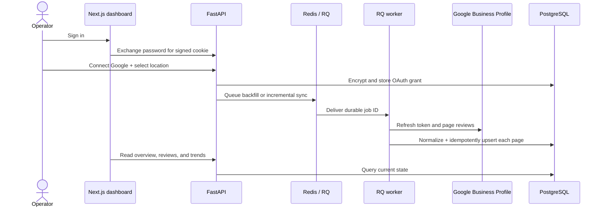
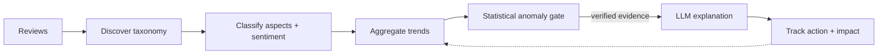
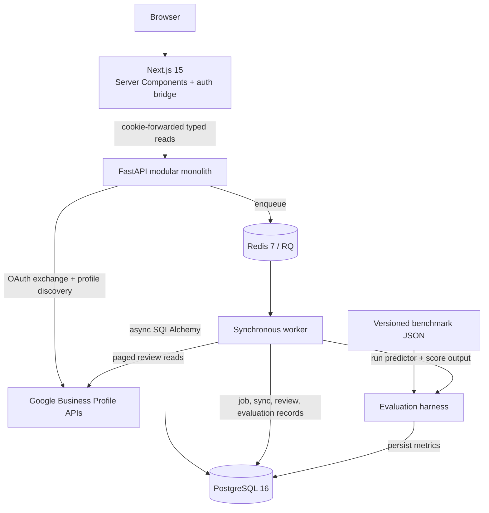

<div align="center">

<picture>
  <source media="(prefers-color-scheme: dark)" srcset="docs/assets/logo-dark.svg">
  
</picture>

### Turn Google reviews into an operating signal—not another sentiment dashboard.

An internal, local-first customer-intelligence platform built for **Maple Photo Imaging**.

[](https://github.com/Bruce1508/reviewSignal/actions/workflows/check.yml)
[](pyproject.toml)
[](https://www.python.org/)
[](https://nextjs.org/)
[](https://www.postgresql.org/)
[](LICENSE)

[Demo](#-demo) · [Architecture](#-architecture) · [Quick start](#-quick-start) · [Usage](#-usage) · [Roadmap](#-roadmap)

</div>

ReviewSignal preserves Google Business Profile reviews, tracks rating and category trends, and is
being built to discover a business-specific taxonomy, classify aspect-level sentiment, detect
low-volume anomalies, and turn verified evidence into trackable actions.

> [!IMPORTANT]
> **Current build:** the Google OAuth and ingestion path, encrypted credentials, durable RQ jobs,
> evaluation harness, PostgreSQL schema, authenticated API, and six dashboard read pages are
> implemented. Taxonomy generation, review classification, anomaly detection, and recommendation
> generation are the next product stages—not shipped features. Google integration is contract-tested
> against recorded payloads; a live sync still requires an approved Google API project and profile.

## 🎬 Demo

<!-- TODO(demo): Record a 15–20 second, 1440×900 GIF from a freshly seeded local build. Show: sign in → Overview metrics → Reviews keyword/rating filters → Trends rating history → Settings. Save it as docs/assets/dashboard-demo.gif, then replace this comment with: <p align="center"></p> -->

<!-- TODO(screenshot): Capture the Overview page after `make seed` at 1440×900 in both light and dark mode. Crop browser chrome, keep the navigation and all three stat cards visible, and save the preferred version as docs/assets/dashboard-overview.png. Add it below the GIF as:  -->

Use the real ingestion path with safe synthetic data while Google access is being configured:

```console
$ make seed
seeded stub corpus: fetched=150 created=150 updated=0 unchanged=0 unmappable=0

$ curl -sS http://localhost:8000/api/v1/health | python -m json.tool
{
  "data": {"status": "ok", "components": {"api": "ok", "database": "ok", "redis": "ok"}},
  "error": null
}
```

The first seed on an empty database creates 150 deterministic reviews. Re-running it updates the
same source IDs instead of creating duplicates.

## ✨ Features

| Available today                                                                               | Product direction                                                               |
| --------------------------------------------------------------------------------------------- | ------------------------------------------------------------------------------- |
| Google OAuth, account/location discovery, token refresh, and Fernet-encrypted credentials     | Corpus-driven hierarchical taxonomy—no seeded business labels                   |
| Full backfill and incremental review sync through a source-neutral adapter                    | Multi-label aspect classification with sentiment, confidence, and evidence      |
| Idempotent upserts that preserve rating-only reviews, owner replies, and raw payloads         | Hybrid embedding classifier with Qwen fallback for uncertain or novel reviews   |
| Overview, review search/filtering, rating trends, taxonomy, insights, and settings read views | Low-volume-aware anomaly detection before any LLM explanation                   |
| Versioned evaluation runs with classification, sentiment, and calibration metrics             | Evidence-grounded recommendations and before/after action tracking              |
| Signed operator sessions, structured API errors, health checks, retries, and dead letters     | Taxonomy editing, immutable versions, rollback, and historical reclassification |

## 🔄 How it works

The implemented ingestion flow keeps HTTP requests short and source data recoverable:



The planned intelligence loop deliberately places deterministic measurement before language-model
reasoning:



## 🏗 Architecture



| Engineering decision                                          | Why it matters                                                                                        |
| ------------------------------------------------------------- | ----------------------------------------------------------------------------------------------------- |
| **PostgreSQL owns state; Redis transports work**              | Queue infrastructure can change without losing the inspectable job lifecycle.                         |
| **Commit ingestion page by page**                             | A mid-backfill failure retains completed work and records a truthful `partial` run.                   |
| **Use the last successful run's start time as the watermark** | Reviews edited during the previous sync cannot fall into a timestamp gap.                             |
| **Validate ground truth instead of coercing it**              | A malformed benchmark fails visibly rather than producing deceptively better scores.                  |
| **Database-enforced invariants**                              | Ratings, confidence ranges, statuses, source IDs, and the single active taxonomy survive concurrency. |
| **LLM-powered, not LLM-dependent**                            | The design reserves language models for semantic judgment; code and statistics own repeatable work.   |

## 🧰 Tech stack

| Layer              | Technology in this repository                                                          |
| ------------------ | -------------------------------------------------------------------------------------- |
| Web                | Next.js 15, React 19, TypeScript, Server Components                                    |
| API                | Python 3.12+, FastAPI, Pydantic 2, Uvicorn                                             |
| Persistence        | PostgreSQL 16, SQLAlchemy 2 async/sync sessions, Psycopg 3, Alembic                    |
| Jobs               | Redis 7, RQ 2, bounded retry backoff, application-level dead-letter state              |
| Integration        | Google Business Profile APIs, OAuth 2.0, HTTPX, Fernet encryption                      |
| Evaluation         | Strict JSON datasets, micro/macro P/R/F1, sentiment confusion matrix, Brier score, ECE |
| Quality            | Pytest, Ruff, Pyright, ESLint, Prettier, GitHub Actions                                |
| Planned AI runtime | LangGraph, Ollama/Qwen, BGE embeddings, PyTorch, scikit-learn, Pandas/NumPy/SciPy      |

The planned AI tools are architectural choices documented in `docs/`; they are not installed or
wired into v0.1.0 yet.

## 🚀 Quick start

### Prerequisites

- Docker with Compose v2
- [`uv`](https://docs.astral.sh/uv/) and Python 3.12+
- Node.js 22+

```bash
git clone https://github.com/Bruce1508/reviewSignal.git
cd reviewSignal
cp .env.example .env

make install
make up
make migrate
make seed       # optional: populate the dashboard with synthetic reviews
```

Replace `SESSION_SECRET` and `OPERATOR_PASSWORD` in `.env`, then start three processes:

```bash
make api        # FastAPI:  http://localhost:8000  · OpenAPI: /docs
make worker     # RQ worker: required for Google and evaluation jobs
make web        # Dashboard: http://localhost:3000
```

Sign in at `http://localhost:3000/login` with `OPERATOR_PASSWORD`. `make up` intentionally starts
only PostgreSQL and Redis; API, worker, and web stay visible in their own development terminals.

## ⚙️ Configuration

| Variable                                                          | Purpose                                                                            |
| ----------------------------------------------------------------- | ---------------------------------------------------------------------------------- |
| `APP_ENV`                                                         | `local` keeps cookies usable over HTTP; other values mark them `Secure`.           |
| `DATABASE_URL`, `REDIS_URL`                                       | Required PostgreSQL and Redis connections.                                         |
| `SESSION_SECRET`, `OPERATOR_PASSWORD`                             | Sign the 12-hour stateless session and authenticate the single operator.           |
| `GOOGLE_CLIENT_ID`, `GOOGLE_CLIENT_SECRET`, `GOOGLE_REDIRECT_URI` | Google OAuth application credentials and callback.                                 |
| `CREDENTIAL_ENCRYPTION_KEY`                                       | Fernet key used to encrypt OAuth tokens in PostgreSQL.                             |
| `OLLAMA_BASE_URL`, `OLLAMA_MODEL`, `EMBEDDING_MODEL`              | Declared model configuration; inference is not connected yet.                      |
| `BENCHMARK_PATH`                                                  | Versioned JSON benchmark read by an evaluation job once a predictor is registered. |
| `NEXT_PUBLIC_API_BASE_URL`                                        | Web-to-API base URL; defaults to `http://localhost:8000/api/v1`.                   |

Generate a valid credential-encryption key after installing dependencies, then paste it into `.env`:

```bash
uv run python -c "from cryptography.fernet import Fernet; print(Fernet.generate_key().decode())"
```

See [`.env.example`](.env.example) for the complete local template. Never commit `.env`.

## 🖥 Usage

### Explore with synthetic reviews

```bash
make seed
make api
make web
```

Open `/overview`, filter `/reviews` by text/rating/date, and inspect `/trends`. The stub adapter uses
the same ingestion service as Google but a separate `source="stub"` watermark.

### Call the authenticated API

```bash
curl -sS -c /tmp/reviewsignal.cookies \
  -H 'Content-Type: application/json' \
  -d '{"password":"YOUR_OPERATOR_PASSWORD"}' \
  http://localhost:8000/api/v1/auth/login

curl -sS -b /tmp/reviewsignal.cookies \
  'http://localhost:8000/api/v1/reviews?page=1&page_size=5&rating=5' \
  | python -m json.tool
```

All documented API endpoints use `{"data": ..., "error": null}` or a stable structured error
envelope.

### Connect Google Business Profile

1. Configure the Google OAuth variables and `CREDENTIAL_ENCRYPTION_KEY`; keep the worker running.
2. Sign in to the dashboard, then open `http://localhost:8000/api/v1/google/connect` in that browser.
3. After the callback, use `http://localhost:8000/docs` to list accounts, list locations, select one,
   and submit `/google/backfill` or `/google/sync`.
4. Follow `/system/status` and the worker log for queue depth, sync counts, retries, or failures.

The evaluation API can list persisted runs today. Submitting a new run correctly returns
`MODEL_UNAVAILABLE` until a predictor is registered; the shipped synthetic dataset proves the
harness contract only and must not be reported as a real model result.

## 🗂 Project structure

```text
apps/
├── api/reviewsignal_api/   # routes → services → repositories; integrations + evaluation
└── web/                    # Next.js dashboard and login/logout bridge
workers/reviewsignal_worker # RQ entrypoint, lifecycle wrapper, ingestion/evaluation handlers
migrations/                 # Alembic baseline plus schema evolution
data/benchmarks/            # versioned evaluation datasets (currently synthetic only)
tools/                      # synthetic seeder and documentation-citation gate
packages/                   # reserved AI, analytics, and shared-integration seams
infra/                      # API, worker, and web Dockerfiles
docs/                       # architecture and subsystem contracts
tests/                      # API, DB, worker, integration, evaluation, and tool coverage
```

Run the same gate used by CI:

```bash
make check    # Ruff + citation checks + ESLint + Prettier + Pyright + tsc + pytest + Next build
```

Tests use real PostgreSQL constraints and Redis/RQ behavior, so run `make up` and `make migrate`
first. Start with the [documentation index](docs/README.md), then read the
[architecture](docs/architecture.md), [API contract](docs/api-spec.md),
[data model](docs/data-model.md), and [evaluation design](docs/evaluation.md).

## 🗺 Roadmap

- [x] Foundation: modular monolith, 15-table schema, job lifecycle, Docker topology, and CI gate.
- [x] Google connector implementation: OAuth, encrypted tokens, profile selection, mapping, and sync.
- [x] Evaluation foundation: strict dataset loader, metrics, run persistence, and queued job contract.
- [x] Authenticated dashboard read surfaces and deterministic synthetic development corpus.
- [ ] Complete live Google authorization/backfill and create the human-labelled benchmark.
- [ ] Implement taxonomy discovery and multi-label aspect/sentiment classification.
- [ ] Add confidence routing, low-volume anomaly detection, grounded insights, and action tracking.
- [ ] Add taxonomy editing/version lifecycle, production observability, AWS hardening, and backups.

## 👤 Author

Built by **[Bruce Vo](https://github.com/Bruce1508)** as a production-oriented applied-AI system for
a real small-business workflow—not a tutorial clone.

Released under the [MIT License](LICENSE). The local, Git-ignored client PRD is not distributed with
this repository; public architecture and implementation contracts live under [`docs/`](docs/README.md).
