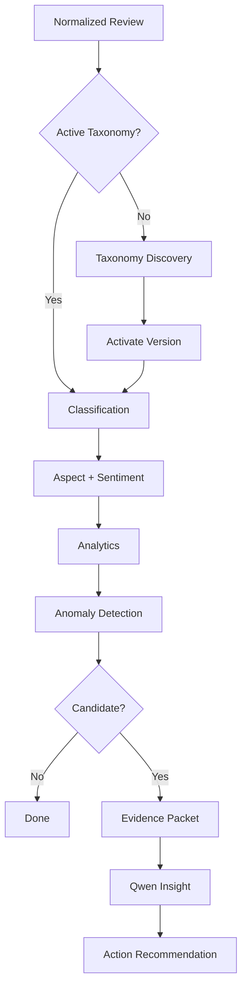
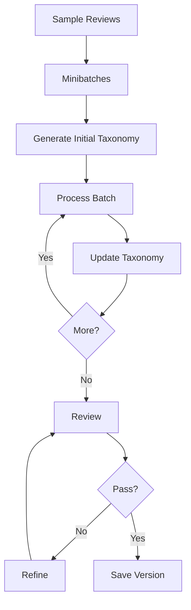
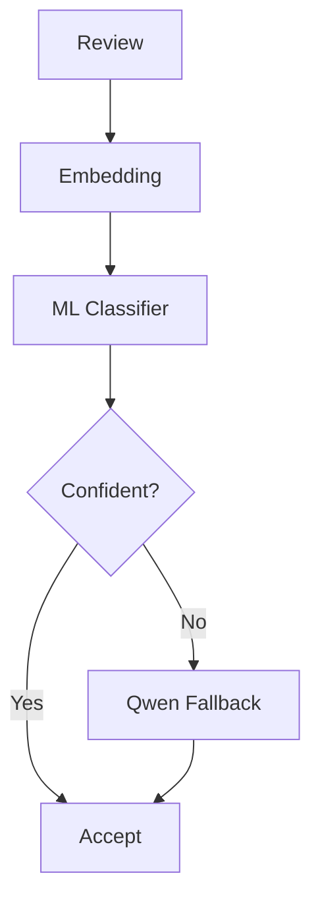
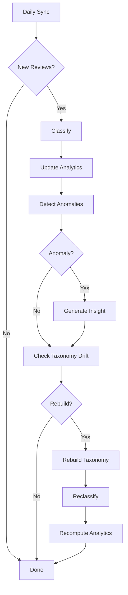

# ReviewSignal AI — AI Pipeline
**Status:** Draft v1.2  
**Scope:** AI workflows only. Metrics live in `evaluation.md`.

## Documentation links
Read [`README.md`](README.md) for the documentation hierarchy. Product behavior
comes from [`PRD.md`](PRD.md); system boundaries come from
[`architecture.md`](architecture.md). This document depends on the persistence
contracts in [`data-model.md`](data-model.md), exposes work through
[`api-spec.md`](api-spec.md), runs within [`deployment.md`](deployment.md), and
is measured by [`evaluation.md`](evaluation.md).

## 1. Purpose
The AI pipeline converts raw Google reviews into a data-driven taxonomy, multi-label aspects, aspect sentiment, confidence scores, anomaly evidence, grounded insights, and action recommendations.
Core rule: use LLM reasoning for semantic tasks; use ML/statistics for repeatable tasks.

## 2. AI Stack
| Concern | Technology |
|---|---|
| Workflow | LangGraph |
| LLM helpers | LangChain |
| Runtime | Ollama |
| Reasoning model | Qwen |
| Embeddings | BGE / Sentence Transformers |
| Deep learning | PyTorch |
| Classifier | scikit-learn |
| Analytics | Pandas / NumPy / SciPy |

## 3. End-to-End Flow


## 4. Review Input
```json
{"review_id":"google-id","rating":2,"text":"Good photo quality but I waited almost 30 minutes.","created_at":"2026-09-01T15:22:00Z","owner_reply":"Thank you for your feedback.","source":"google_business_profile","language":"en"}
```
MVP analyzes English text only.

## 5. Preprocessing
Do: trim whitespace, normalize Unicode, reject empty text, preserve natural wording/metadata, deduplicate by source ID.  
Do not: stem, remove stop words, strip useful punctuation, or aggressively lowercase.

## 6. Taxonomy Goal
No business categories are seeded manually. The taxonomy should be grounded, hierarchical, concise, minimally overlapping, and operationally meaningful.

## 7. LangGraph State
```python
class TaxonomyState(TypedDict):
    reviews: list
    batches: list
    batch_index: int
    current_taxonomy: dict
    previous_taxonomy: dict | None
    review_feedback: dict | None
    iteration_count: int
    status: str
```

## 8. Taxonomy Workflow

Bound refinement to roughly 3–5 iterations.

## 9. Taxonomy Node
```json
{"name":"Service","description":"Customer feedback about service delivery.","children":[{"name":"Wait Time","description":"Feedback about delays or slow service.","children":[]}]}
```
Descriptions are required so classification uses semantic meaning, not label names alone.

## 10. Taxonomy Review
Check duplicate categories, semantic overlap, missing themes, over-broad/over-narrow nodes, unsupported nodes, and poor hierarchy.
Example:
```json
{"accepted":false,"issues":[{"type":"overlap","categories":["Staff Friendliness","Staff Attitude"],"recommendation":"Consider a shared parent."}]}
```

## 11. Automatic Acceptance
A candidate taxonomy becomes active automatically once the quality gate passes. The user can edit it later.

## 12. Rebuild Signals
Do not rebuild daily. Consider: enough new reviews, rising low-confidence rate, repeated unmatched reviews, embedding novelty, manual rebuild, or evaluation regression.

## 13. Novelty Signal
```python
novelty = 1 - max_cosine_similarity(review_embedding, category_embeddings)
```
Novelty contributes evidence for rebuild; it never creates a category automatically.

## 14. Taxonomy Change
```text
new version
→ activate
→ reclassify historical reviews
→ recompute analytics
→ re-evaluate affected insights
```

## 15. Multi-Label Classification
Example review: `"Great photo and friendly staff, but the wait was long."`
```json
{"aspects":[{"category_id":"photo_quality","sentiment":"positive","confidence":0.95,"evidence":"Great photo"},{"category_id":"staff_experience","sentiment":"positive","confidence":0.91,"evidence":"friendly staff"},{"category_id":"wait_time","sentiment":"negative","confidence":0.97,"evidence":"the wait was long"}]}
```

## 16. Aspect Sentiment
Supported MVP labels: `positive`, `neutral`, `negative`. Sentiment belongs to each aspect, not only the whole review.

## 17. Evidence
Store a short evidence span for each prediction. Display category, sentiment, confidence, and evidence. Never expose hidden chain-of-thought.

## 18. Initial Classification
Before a lightweight classifier exists:
```text
review + active taxonomy + node descriptions + rating
→ Qwen
→ schema-validated multi-label output
```

## 19. Why Hybrid ML + LLM
After enough labels exist:
```text
human labels + accepted model labels
→ training dataset
→ embedding classifier
```
Easy reviews use ML; ambiguous/novel reviews use Qwen.

## 20. Embeddings
Candidates: `BAAI/bge-small-en-v1.5`, `BAAI/bge-base-en-v1.5`, `all-MiniLM-L6-v2`.
Select using measured quality, latency, memory, and deployment constraints. PyTorch powers embedding inference.

## 21. Classifier
MVP candidates: One-vs-Rest Logistic Regression or another calibrated linear classifier.
Input: review embedding. Output: score per taxonomy category.

## 22. Confidence Routing

Confidence can use top probability, margin, novelty, and taxonomy freshness. Thresholds come from evaluation, not guesswork.

## 23. LLM Fallback
Use Qwen when classifier confidence is low, review is novel, labels are ambiguous, mixed sentiment is complex, taxonomy recently changed, or the classifier is unavailable.

## 24. Retraining
Retrain after meaningful taxonomy changes, enough new reviewed labels, evaluation regression, or manual trigger. Promote only after benchmark evaluation passes.

## 25. Analytics Inputs
Use structured fields: rating, date, weekday, category, sentiment, confidence, taxonomy version.
Normal aggregations do not require an LLM.

## 26. Core Metrics
Review count, average rating, category frequency, negative/positive mention rate, rating by category, rolling trends, and period comparisons.

## 27. Anomaly Goal
Avoid naive rules such as `increase > 50% → alert`; low volume makes those noisy.

## 28. Anomaly Inputs
Current count, historical baseline, negative rate, total review volume, average rating, confidence, variance, and rolling history.

## 29. Statistical Strategy
Start simple and low-volume aware: rolling baselines, EWMA, count-based/Bayesian methods, and minimum-support rules. An anomaly advances only when statistical evidence + minimum support + acceptable classification confidence are present.

## 30. Evidence Packet
```json
{"category":"Wait Time","current_negative_mentions":5,"historical_baseline":1.4,"average_rating":2.6,"high_frequency_weekdays":["Friday","Saturday"],"representative_reviews":["..."],"owner_reply_context":["..."]}
```

## 31. Insight Output
```json
{"title":"Wait-time complaints increased","summary":"Negative wait-time mentions are above the recent baseline.","severity":"medium","evidence_summary":"5 mentions versus an expected baseline of 1.4.","recommended_actions":["Review staffing coverage during peak periods.","Measure average customer handling time."]}
```

## 32. Recommendation Rules
The model must separate observation from hypothesis, avoid causal claims, remain grounded in supplied evidence, avoid generic advice, and recommend specific operational actions.

## 33. Insight Lifecycle
States: `New`, `Monitoring`, `Resolved`. The system may propose transitions; the user can override them.

## 34. Action & Impact
Store action text/date/notes. Compare negative aspect rate, average rating, category frequency, and review volume before vs after. Report association, not causation.

## 35. Prompt Versioning
Example IDs: `taxonomy_generate_v1`, `taxonomy_review_v1`, `classification_v1`, `insight_generate_v1`.
Every model run stores prompt version.

## 36. Model Run Logging
Record task, model, model version, prompt version, taxonomy version, input count, latency, success, fallback use, error, and timestamp.

## 37. Failure Handling
```text
schema failure → retry with stricter constraints → retry → DLQ
timeout → retry with backoff → DLQ
```

## 38. Model Abstraction
```python
class LLMProvider:
    async def generate_structured(...): ...
```
Initial implementation: `OllamaProvider`. Future compatible providers may include vLLM, OpenAI-compatible endpoints, or Bedrock.

## 39. Daily AI Flow


## 40. Implementation Order
1. Taxonomy + Qwen classification + aspect sentiment.
2. Benchmark evaluation and error analysis.
3. BGE embeddings + ML classifier + confidence routing.
4. Anomaly detection + grounded insights.
5. Novelty/taxonomy rebuild automation.
6. Retry/DLQ + model/prompt observability.

## 41. Related Docs
- [`architecture.md`](architecture.md): component boundaries and non-goals.
- [`data-model.md`](data-model.md): taxonomy, analysis, model-run, anomaly, and insight records.
- [`api-spec.md`](api-spec.md): endpoints that queue or expose these workflows.
- [`deployment.md`](deployment.md): worker, Redis, Ollama, and runtime constraints.
- [`evaluation.md`](evaluation.md): benchmark metrics and promotion gates.

## 42. Summary
```text
Review → Taxonomy → Embedding/ML → Confidence Gate → Qwen fallback
→ Aspect + Sentiment → Analytics → Statistical Anomaly
→ Evidence Packet → Qwen Insight → Action + Impact
```
Detailed metrics and promotion gates live in `evaluation.md`.
