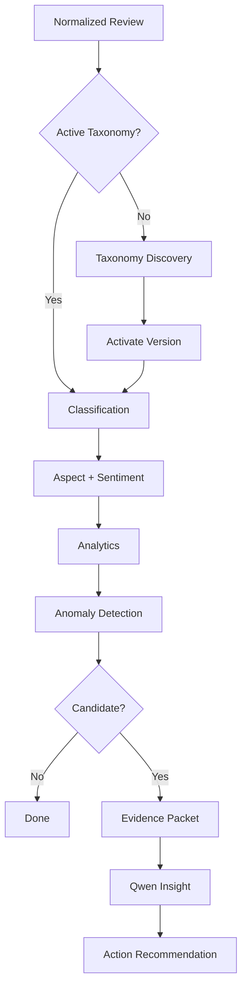
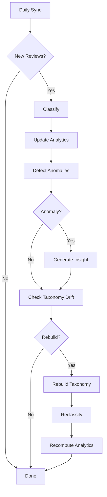

# ReviewSignal AI — AI Pipeline
**Status:** Draft v1.2  
**Scope:** AI workflows only. Metrics live in `evaluation.md`.

## Documentation links
Read [`README.md`](README.md) for the documentation hierarchy. Product behavior
comes from [`PRD.md`](PRD.md); system boundaries come from
[`architecture.md`](architecture.md). This document depends on the persistence
contracts in [`data-model.md`](data-model.md), exposes work through
[`api-spec.md`](api-spec.md), runs within [`deployment.md`](deployment.md), and
is measured by [`evaluation.md`](evaluation.md).

**Split out of this document:** [`taxonomy-pipeline.md`](taxonomy-pipeline.md) (was sections 6-14),
[`classification-pipeline.md`](classification-pipeline.md) (was sections 15-24), and
[`insight-pipeline.md`](insight-pipeline.md) (was sections 25-34). Numbering here keeps its gaps
so existing `§N` citations resolve.

## 1. Purpose
The AI pipeline converts raw Google reviews into a data-driven taxonomy, multi-label aspects, aspect sentiment, confidence scores, anomaly evidence, grounded insights, and action recommendations.
Core rule: use LLM reasoning for semantic tasks; use ML/statistics for repeatable tasks.

## 2. AI Stack
| Concern | Technology |
|---|---|
| Workflow | LangGraph |
| LLM helpers | LangChain |
| Runtime | Ollama |
| Reasoning model | Qwen |
| Embeddings | BGE / Sentence Transformers |
| Deep learning | PyTorch |
| Classifier | scikit-learn |
| Analytics | Pandas / NumPy / SciPy |

## 3. End-to-End Flow


## 4. Review Input
```json
{"review_id":"google-id","rating":2,"text":"Good photo quality but I waited almost 30 minutes.","created_at":"2026-09-01T15:22:00Z","owner_reply":"Thank you for your feedback.","source":"google_business_profile","language":"en"}
```
MVP analyzes English text only.

## 5. Preprocessing
Do: trim whitespace, normalize Unicode, reject empty text, preserve natural wording/metadata, deduplicate by source ID.  
Do not: stem, remove stop words, strip useful punctuation, or aggressively lowercase.

## 15. Multi-Label Classification
Moved to [`classification-pipeline.md`](classification-pipeline.md) §1. The heading stays so existing
`ai-pipeline.md` §15 citations still resolve.

## 22. Confidence Routing
Moved to [`classification-pipeline.md`](classification-pipeline.md) §8. The heading stays so existing
`ai-pipeline.md` §22 citations still resolve.

## 23. LLM Fallback
Moved to [`classification-pipeline.md`](classification-pipeline.md) §9. The heading stays so existing
`ai-pipeline.md` §23 citations still resolve.

## 35. Prompt Versioning
Example IDs: `taxonomy_generate_v1`, `taxonomy_review_v1`, `classification_v1`, `insight_generate_v1`.
Every model run stores prompt version.

## 36. Model Run Logging
Record task, model, model version, prompt version, taxonomy version, input count, latency, success, fallback use, error, and timestamp.

## 37. Failure Handling
```text
schema failure → retry with stricter constraints → retry → DLQ
timeout → retry with backoff → DLQ
```

## 38. Model Abstraction
```python
class LLMProvider:
    async def generate_structured(...): ...
```
Initial implementation: `OllamaProvider`. Future compatible providers may include vLLM, OpenAI-compatible endpoints, or Bedrock.

## 39. Daily AI Flow


## 40. Implementation Order
1. Taxonomy + Qwen classification + aspect sentiment.
2. Benchmark evaluation and error analysis.
3. BGE embeddings + ML classifier + confidence routing.
4. Anomaly detection + grounded insights.
5. Novelty/taxonomy rebuild automation.
6. Retry/DLQ + model/prompt observability.

## 41. Related Docs
- [`architecture.md`](architecture.md): component boundaries and non-goals.
- [`data-model.md`](data-model.md): taxonomy, analysis, model-run, anomaly, and insight records.
- [`api-spec.md`](api-spec.md): endpoints that queue or expose these workflows.
- [`deployment.md`](deployment.md): worker, Redis, Ollama, and runtime constraints.
- [`evaluation.md`](evaluation.md): benchmark metrics and promotion gates.

## 42. Summary
```text
Review → Taxonomy → Embedding/ML → Confidence Gate → Qwen fallback
→ Aspect + Sentiment → Analytics → Statistical Anomaly
→ Evidence Packet → Qwen Insight → Action + Impact
```
Detailed metrics and promotion gates live in `evaluation.md`.
