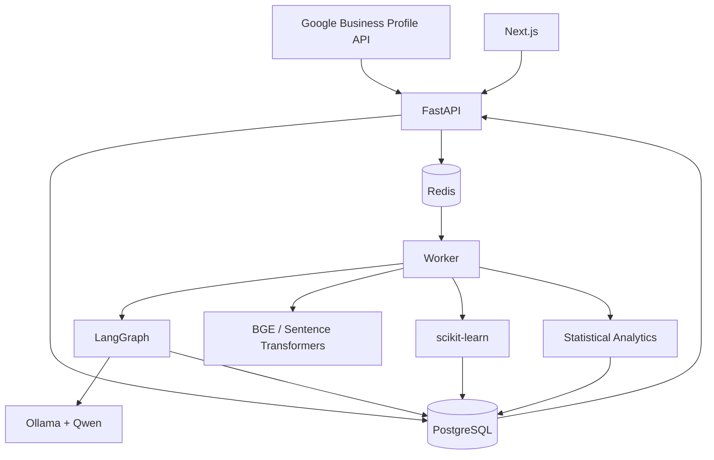

# ReviewSignal AI — Architecture
**Pilot:** Maple Photo Imaging  
**Status:** Draft v1.2  
**Scope:** High-level system structure only.

## Documentation links
Product intent belongs in [`PRD.md`](PRD.md). This document
defines system boundaries; details live in [`ai-pipeline.md`](ai-pipeline.md),
[`data-model.md`](data-model.md), [`api-spec.md`](api-spec.md),
[`deployment.md`](deployment.md), and [`evaluation.md`](evaluation.md). Use
[`README.md`](README.md) for reading order and conflict resolution.

## 1. Purpose
ReviewSignal AI is an internal AI Customer Intelligence Platform that converts Google Business Profile reviews into structured feedback, trends, anomalies, insights, and trackable actions.
Architecture goals: simple for one developer, production-oriented, cost-conscious, local-model friendly, extensible beyond Google Reviews, and portfolio-ready.

## 2. Non-goals for MVP
- Multi-tenant SaaS or multiple locations.
- Kubernetes or complex microservices.
- Real-time streaming.
- Complex RBAC.
- Distributed training.

## 3. Tech Stack
| Layer | Technology |
|---|---|
| Frontend | Next.js + TypeScript |
| Backend | FastAPI + Python |
| Database | PostgreSQL |
| Queue | Redis + RQ/Celery |
| AI workflow | LangGraph |
| LLM utilities | LangChain |
| LLM runtime | Ollama |
| Reasoning model | Qwen |
| Deep learning | PyTorch |
| Embeddings | Sentence Transformers / BGE |
| ML | scikit-learn |
| Analytics | Pandas + NumPy + SciPy |
| Source | Google Business Profile API |
| Infra | Docker Compose + Nginx |
| Cloud | AWS EC2 + RDS |
| Monitoring | CloudWatch + app logs |

## 4. High-Level Architecture


## 5. Core Principle
> **LLM-powered, not LLM-dependent.**
Use Qwen for taxonomy generation/review, difficult classification, grounded explanations, and recommendations. Use normal software/ML/statistics for syncing, embeddings, routine classification, aggregation, trend calculation, anomaly detection, and dashboard metrics.

## 6. Main Components
### Next.js
Pages: `/overview`, `/reviews`, `/taxonomy`, `/trends`, `/insights`, `/settings`.
Responsibilities: presentation, filtering/search, taxonomy editing, insight/action management, manual job triggers, system status.
It never runs AI inference directly.

### FastAPI
Responsibilities: REST API, business logic, Google OAuth/API integration, taxonomy operations, analytics retrieval, job submission, settings, health endpoints.
Suggested modules: `api/`, `services/`, `repositories/`, `integrations/`, `ai/`, `analytics/`, `jobs/`.

### PostgreSQL
Source of truth for raw/normalized reviews, taxonomy versions/nodes, analyses, insights/actions, anomalies, sync runs, model runs, and evaluations.

### Redis + Worker
Async jobs: backfill, daily sync, review analysis, taxonomy rebuild, reclassification, classifier training, anomaly detection, insight generation, impact analysis.
Long-running AI work never blocks HTTP requests.

## 7. Review Ingestion
Initial setup:
```text
Google Business Profile
→ backfill historical reviews
→ normalize + preserve raw payload
→ PostgreSQL
→ initial taxonomy
→ historical classification
→ baseline analytics
```
Daily sync:
```text
scheduler
→ fetch new/updated reviews
→ persist
→ queue analysis
→ update analytics
→ detect anomalies
→ generate/update insights
```
The ingestion contract should be source-agnostic so Yelp, surveys, or support tickets can be added later.

## 8. AI System Boundaries
Four AI-facing subsystems:
1. Taxonomy discovery/refinement.
2. Review classification + aspect sentiment.
3. Anomaly interpretation.
4. Action recommendation.
Detailed behavior lives in `ai-pipeline.md`.

## 9. Taxonomy Lifecycle
```text
reviews
→ generate/update taxonomy
→ quality gate
→ activate version
→ reclassify history
→ recompute analytics
```
Manager edits: rename, merge, split, add, delete, move, rollback. Every mutation creates a new immutable taxonomy version.

## 10. Classification Strategy
Start with Qwen classification, then evolve to:
```text
review
→ embedding
→ ML classifier
→ confidence gate
   ├─ high → accept
   └─ low/novel → Qwen fallback
```
This keeps quality while reducing inference cost.

## 11. Analytics & Insights
```text
structured review labels
→ aggregation
→ statistical anomaly detection
→ evidence packet
→ Qwen explanation
→ action recommendation
```
Statistics decide whether a pattern is unusual. The LLM explains verified evidence rather than inventing trends.

## 12. Insight Lifecycle
States: `New → Monitoring → Resolved`.
The system may suggest transitions; the user can override status and add operational notes. Actions can be compared before/after, but the system must not claim causal proof.

## 13. Reliability
All external/AI jobs follow:
```text
run → retry with backoff → retry → dead-letter queue
```
Required protections: idempotent Google sync, structured-output validation, model timeout handling, failed-job inspection, and manual requeue.

## 14. Security
- Google OAuth secrets never enter source control.
- HTTPS only in production.
- PostgreSQL, Redis, and Ollama are private.
- FastAPI is the only public application boundary.
- Dashboard access is restricted to the owner/admin.
- Secrets use environment variables or AWS secret storage.

## 15. Deployment
Development:
```text
MacBook: Next.js + FastAPI + PostgreSQL + Redis + Worker + Ollama
```
Production MVP:
```text
AWS EC2: Nginx + Next.js + FastAPI + Redis + Worker + Ollama where practical
AWS RDS: PostgreSQL
CloudWatch: logs + basic alerts
```
No Kubernetes for MVP.

## 16. Scalability Path
Stage 1: `EC2 + Docker Compose + RDS`.  
Stage 2: split Web/API, worker, and AI inference only if measured contention appears.  
Stage 3: future SaaS may adopt ECS/Fargate, SQS, dedicated inference, multi-tenancy, and multiple connectors.

## 17. Repository Shape
```text
reviewsignal-ai/
├── apps/web/
├── apps/api/
├── workers/
├── packages/ai/
├── packages/analytics/
├── packages/integrations/
├── infra/
├── docs/
└── tests/
```

## 18. Key Decisions
1. FastAPI because the AI/ML stack is Python-first.
2. PostgreSQL as single source of truth.
3. Async workers for slow/failure-prone workloads.
4. LangGraph for iterative stateful AI workflows.
5. LangChain only where utilities reduce boilerplate.
6. Ollama + Qwen for open-weight/local-first reasoning.
7. Hybrid ML + LLM classification for efficiency.
8. Statistical detection before LLM explanations.
9. Modular monolith first; microservices only when justified.

## 19. Related Docs
- [`ai-pipeline.md`](ai-pipeline.md): AI workflows/models; depends on the boundaries here and the persisted fields in [`data-model.md`](data-model.md).
- [`data-model.md`](data-model.md): database entities/relations; persists outputs from the pipeline and supports the API.
- [`api-spec.md`](api-spec.md): REST contracts; exposes the components and jobs described here.
- [`deployment.md`](deployment.md): AWS/Docker operations for this topology and its health checks.
- [`evaluation.md`](evaluation.md): benchmark and quality gates for AI decisions and model promotion.
- [`README.md`](README.md): documentation map, hierarchy, and conflict rules.

## 20. Summary
```text
Google Business Profile
→ FastAPI ingestion
→ PostgreSQL
→ Redis jobs
→ LangGraph / Qwen / ML / Statistics
→ Customer Intelligence
→ FastAPI
→ Next.js
```
The MVP is a **modular monolith with asynchronous AI workers**: simple enough to maintain, but structured enough to evolve.
