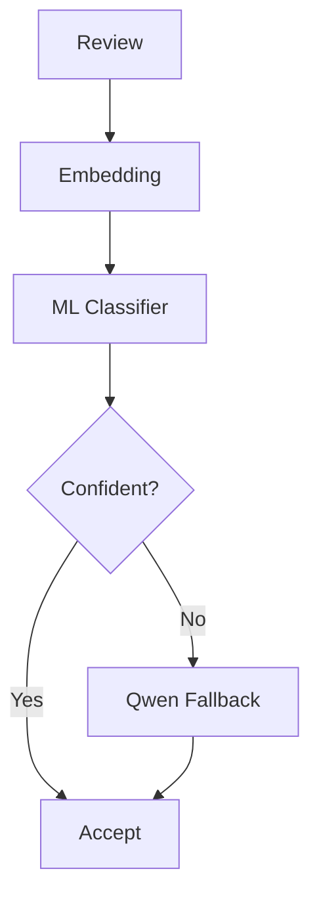

# ReviewSignal AI — Classification Pipeline
**Status:** Draft v1.1  
**Scope:** Assigning aspects, sentiment, and evidence to a review, and routing by confidence.

## Documentation links
Read [`README.md`](README.md) for hierarchy and conflict rules. This workflow runs inside the pipeline owned by
[`ai-pipeline.md`](ai-pipeline.md), consumes the taxonomy from
[`taxonomy-pipeline.md`](taxonomy-pipeline.md), writes the tables in
[`data-model.md`](data-model.md), and is scored by [`evaluation.md`](evaluation.md).

## 1. Multi-Label Classification
Example review: `"Great photo and friendly staff, but the wait was long."`
```json
{"aspects":[{"category_id":"photo_quality","sentiment":"positive","confidence":0.95,"evidence":"Great photo"},{"category_id":"staff_experience","sentiment":"positive","confidence":0.91,"evidence":"friendly staff"},{"category_id":"wait_time","sentiment":"negative","confidence":0.97,"evidence":"the wait was long"}]}
```

## 2. Aspect Sentiment
Supported MVP labels: `positive`, `neutral`, `negative`. Sentiment belongs to each aspect, not only the whole review.

## 3. Evidence
Store a short evidence span for each prediction. Display category, sentiment, confidence, and evidence. Never expose hidden chain-of-thought.

## 4. Initial Classification
Before a lightweight classifier exists:
```text
review + active taxonomy + node descriptions + rating
→ Qwen
→ schema-validated multi-label output
```

## 5. Why Hybrid ML + LLM
After enough labels exist:
```text
human labels + accepted model labels
→ training dataset
→ embedding classifier
```
Easy reviews use ML; ambiguous/novel reviews use Qwen.

## 6. Embeddings
Candidates: `BAAI/bge-small-en-v1.5`, `BAAI/bge-base-en-v1.5`, `all-MiniLM-L6-v2`.
Select using measured quality, latency, memory, and deployment constraints. PyTorch powers embedding inference.

## 7. Classifier
MVP candidates: One-vs-Rest Logistic Regression or another calibrated linear classifier.
Input: review embedding. Output: score per taxonomy category.

## 8. Confidence Routing

Confidence can use top probability, margin, novelty, and taxonomy freshness. Thresholds come from evaluation, not guesswork.

## 9. LLM Fallback
Use Qwen when classifier confidence is low, review is novel, labels are ambiguous, mixed sentiment is complex, taxonomy recently changed, or the classifier is unavailable.

## 10. Retraining
Retrain after meaningful taxonomy changes, enough new reviewed labels, evaluation regression, or manual trigger. Promote only after benchmark evaluation passes.
