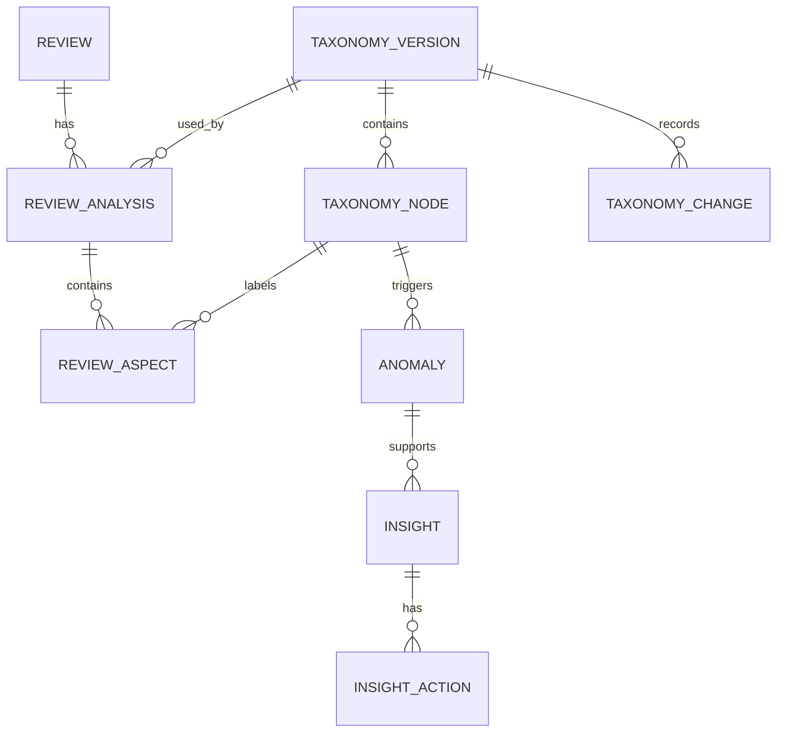

# ReviewSignal AI — Data Model
**Status:** Draft v1.1  
**Scope:** Core PostgreSQL entities and relationships.

## Documentation links
Read [`README.md`](README.md) for hierarchy and conflict rules. Product intent is owned
by [`PRD.md`](PRD.md); the system boundary by [`architecture.md`](architecture.md). This
model stores outputs from [`ai-pipeline.md`](ai-pipeline.md), supports contracts in
[`api-spec.md`](api-spec.md), and stays compatible with
[`deployment.md`](deployment.md) and [`evaluation.md`](evaluation.md). The run-record
tables it used to define now live in [`model-runs.md`](model-runs.md).

**Split out of this document:** [`taxonomy-tables.md`](taxonomy-tables.md) (was sections 5-7),
[`analysis-tables.md`](analysis-tables.md) (was sections 8-12), and
[`operational-tables.md`](operational-tables.md) (was sections 13, 14, 17, and 18). Numbering
here keeps its gaps so existing `§N` citations resolve.

## 1. Principles
- Preserve raw Google data.
- Keep normalized data queryable.
- Version taxonomy and AI outputs.
- Support historical reclassification and rollback.
- Store evidence, not hidden chain-of-thought.
- PostgreSQL is the source of truth.

## 2. Core Entities
`reviews`, `review_analyses`, `review_aspects`, `taxonomy_versions`, `taxonomy_nodes`, `taxonomy_changes`, `anomalies`, `insights`, `insight_actions`, `sync_runs`, `jobs`, `model_runs`, `evaluation_runs`, `settings`, `source_credentials`.

## 3. Relationship Overview


## 4. `reviews`
Purpose: normalized review plus preserved source payload.
```text
id UUID PK
source VARCHAR
source_review_id VARCHAR UNIQUE
rating SMALLINT
review_text TEXT NULL
reviewer_name TEXT NULL
created_at TIMESTAMPTZ
updated_at TIMESTAMPTZ
owner_reply_text TEXT NULL
owner_reply_at TIMESTAMPTZ NULL
language VARCHAR
raw_payload JSONB
analysis_status VARCHAR
inserted_at TIMESTAMPTZ
```
Indexes: unique `source_review_id`, plus `created_at`, `rating`, `analysis_status`.

`review_text` is nullable: a source may return a star rating with no comment. Such
reviews are stored so rating and volume trends stay complete, with
`analysis_status = 'skipped'` because there is nothing to classify.

## 5. `taxonomy_versions`
Moved to [`taxonomy-tables.md`](taxonomy-tables.md) §1. The heading stays so existing
`data-model.md` §5 citations still resolve.

## 6. `taxonomy_nodes`
Moved to [`taxonomy-tables.md`](taxonomy-tables.md) §2. The heading stays so existing
`data-model.md` §6 citations still resolve.

## 7. `taxonomy_changes`
Moved to [`taxonomy-tables.md`](taxonomy-tables.md) §3. The heading stays so existing
`data-model.md` §7 citations still resolve.

## 8. `review_analyses`
Moved to [`analysis-tables.md`](analysis-tables.md) §1. The heading stays so existing
`data-model.md` §8 citations still resolve.

## 9. `review_aspects`
Moved to [`analysis-tables.md`](analysis-tables.md) §2. The heading stays so existing
`data-model.md` §9 citations still resolve.

## 10. `anomalies`
Moved to [`analysis-tables.md`](analysis-tables.md) §3. The heading stays so existing
`data-model.md` §10 citations still resolve.

## 11. `insights`
Moved to [`analysis-tables.md`](analysis-tables.md) §4. The heading stays so existing
`data-model.md` §11 citations still resolve.

## 12. `insight_actions`
Moved to [`analysis-tables.md`](analysis-tables.md) §5. The heading stays so existing
`data-model.md` §12 citations still resolve.

## 13. `sync_runs`
Moved to [`operational-tables.md`](operational-tables.md) §1. The heading stays so existing
`data-model.md` §13 citations still resolve.

## 14. `jobs`
Moved to [`operational-tables.md`](operational-tables.md) §2. The heading stays so existing
`data-model.md` §14 citations still resolve.

## 15. `model_runs`
Moved to [`model-runs.md`](model-runs.md) §1. The heading stays so existing
`data-model.md` §15 citations still resolve.

## 16. `evaluation_runs`
Moved to [`model-runs.md`](model-runs.md) §2. The heading stays so existing
`data-model.md` §16 citations still resolve.

## 17. `settings`
Moved to [`operational-tables.md`](operational-tables.md) §3. The heading stays so existing
`data-model.md` §17 citations still resolve.

## 18. `source_credentials`
Moved to [`operational-tables.md`](operational-tables.md) §4. The heading stays so existing
`data-model.md` §18 citations still resolve.

## 19. Current vs Historical State
Never destructively overwrite previous AI state. A review accumulates analyses, each
pinned to the taxonomy version that produced it. Current queries use the active
taxonomy and current analysis; the superseded rows support audit and rollback.

## 20. Raw vs Normalized Data
Keep `raw_payload` for source fidelity/reprocessing and normalized columns for normal application queries. Do not query Google-specific JSON for dashboard operations.

## 21. Constraints
- `rating` between 1 and 5.
- `confidence` between 0 and 1.
- one active taxonomy version.
- unique source review ID.
- valid sentiment/status enums.

## 22. Transaction Boundaries
Use transactions when activating a taxonomy version, archiving the previous version, inserting its nodes, and recording changes. Activation must never leave two active versions.

## 23. Common Query Patterns
Optimize for reviews by date/rating/category/sentiment, negative theme frequency, category trends, active insights, taxonomy tree, failed jobs, and latest sync state. Add indexes from measured queries, not speculation.

## 24. Retention
Retain raw reviews, taxonomy history, previous analyses, model runs, and evaluation runs. Rotate verbose application logs separately.

## 25. Future Extensibility
Future feedback sources map into the same normalized model. Do not add multi-tenant/location complexity until required.
