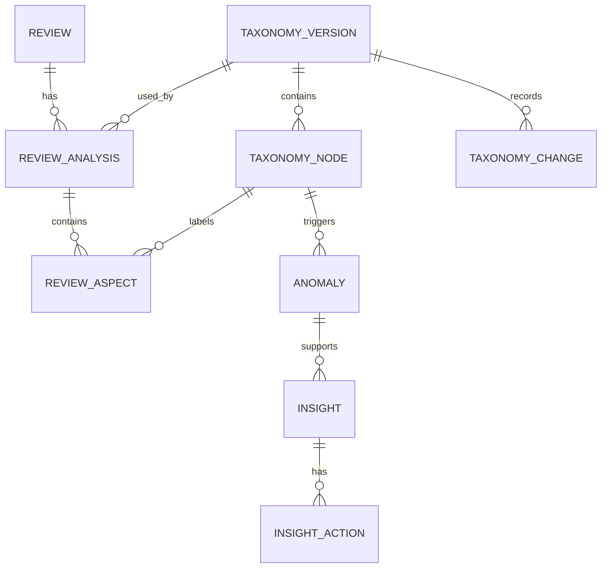

# ReviewSignal AI — Data Model
**Status:** Draft v1.1  
**Scope:** Core PostgreSQL entities and relationships.

## Documentation links
Read [`README.md`](README.md) for hierarchy and conflict rules. Product intent is owned
by [`PRD.md`](PRD.md); the system boundary by [`architecture.md`](architecture.md). This
model stores outputs from [`ai-pipeline.md`](ai-pipeline.md), supports contracts in
[`api-spec.md`](api-spec.md), and stays compatible with
[`deployment.md`](deployment.md) and [`evaluation.md`](evaluation.md).

## 1. Principles
- Preserve raw Google data.
- Keep normalized data queryable.
- Version taxonomy and AI outputs.
- Support historical reclassification and rollback.
- Store evidence, not hidden chain-of-thought.
- PostgreSQL is the source of truth.

## 2. Core Entities
`reviews`, `review_analyses`, `review_aspects`, `taxonomy_versions`, `taxonomy_nodes`, `taxonomy_changes`, `anomalies`, `insights`, `insight_actions`, `sync_runs`, `jobs`, `model_runs`, `evaluation_runs`, `settings`, `source_credentials`.

## 3. Relationship Overview


## 4. `reviews`
Purpose: normalized review plus preserved source payload.
```text
id UUID PK
source VARCHAR
source_review_id VARCHAR UNIQUE
rating SMALLINT
review_text TEXT NULL
reviewer_name TEXT NULL
created_at TIMESTAMPTZ
updated_at TIMESTAMPTZ
owner_reply_text TEXT NULL
owner_reply_at TIMESTAMPTZ NULL
language VARCHAR
raw_payload JSONB
analysis_status VARCHAR
inserted_at TIMESTAMPTZ
```
Indexes: unique `source_review_id`, plus `created_at`, `rating`, `analysis_status`.

`review_text` is nullable: a source may return a star rating with no comment. Such
reviews are stored so rating and volume trends stay complete, with
`analysis_status = 'skipped'` because there is nothing to classify.

## 5. `taxonomy_versions`
Immutable taxonomy version.
```text
id UUID PK
version_number INTEGER
status VARCHAR
created_by VARCHAR
parent_version_id UUID NULL
created_at TIMESTAMPTZ
activated_at TIMESTAMPTZ NULL
archived_at TIMESTAMPTZ NULL
generation_model_run_id UUID NULL
```
Statuses: `candidate`, `active`, `archived`, `failed`. Only one active version.

## 6. `taxonomy_nodes`
```text
id UUID PK
taxonomy_version_id UUID FK
parent_id UUID NULL FK
name VARCHAR
description TEXT
slug VARCHAR
depth INTEGER
sort_order INTEGER
created_at TIMESTAMPTZ
```
Constraint: `UNIQUE(taxonomy_version_id, slug)`.

## 7. `taxonomy_changes`
Audit log between versions.
```text
id UUID PK
from_version_id UUID
to_version_id UUID
change_type VARCHAR
source VARCHAR
old_node_ids JSONB
new_node_ids JSONB
description TEXT
created_at TIMESTAMPTZ
```
Types: `add`, `rename`, `merge`, `split`, `move`, `delete`, `rollback`.

## 8. `review_analyses`
One analysis pass of one review under one taxonomy/model state.
```text
id UUID PK
review_id UUID FK
taxonomy_version_id UUID FK
model_run_id UUID FK
classifier_type VARCHAR
overall_confidence FLOAT NULL
created_at TIMESTAMPTZ
superseded_at TIMESTAMPTZ NULL
```
Classifier type: `llm`, `ml`, `hybrid`, `manual`. Keep previous analyses for auditability.

## 9. `review_aspects`
```text
id UUID PK
review_analysis_id UUID FK
taxonomy_node_id UUID FK
sentiment VARCHAR
confidence FLOAT
evidence_text TEXT
source VARCHAR
created_at TIMESTAMPTZ
```
Sentiment: `positive`, `neutral`, `negative`.
Indexes: `taxonomy_node_id`, `sentiment`, `review_analysis_id`.

## 10. `anomalies`
```text
id UUID PK
taxonomy_node_id UUID FK
taxonomy_version_id UUID FK
period_start DATE
period_end DATE
observed_value FLOAT
expected_value FLOAT
anomaly_score FLOAT
support_count INTEGER
status VARCHAR
method VARCHAR
metadata JSONB
created_at TIMESTAMPTZ
```
Statuses: `candidate`, `accepted`, `dismissed`, `resolved`.

## 11. `insights`
```text
id UUID PK
anomaly_id UUID NULL FK
taxonomy_node_id UUID NULL FK
title VARCHAR
summary TEXT
severity VARCHAR
evidence_summary TEXT
status VARCHAR
generated_by_model_run_id UUID NULL
created_at TIMESTAMPTZ
updated_at TIMESTAMPTZ
resolved_at TIMESTAMPTZ NULL
manual_status_override BOOLEAN DEFAULT FALSE
```
Statuses: `new`, `monitoring`, `resolved`.

## 12. `insight_actions`
```text
id UUID PK
insight_id UUID FK
action_text TEXT
action_date DATE NULL
note_text TEXT NULL
status VARCHAR
created_at TIMESTAMPTZ
updated_at TIMESTAMPTZ
```
Statuses: `planned`, `in_progress`, `completed`, `cancelled`.

## 13. `sync_runs`
```text
id UUID PK
source VARCHAR
started_at TIMESTAMPTZ
finished_at TIMESTAMPTZ NULL
status VARCHAR
reviews_fetched INTEGER
reviews_created INTEGER
reviews_updated INTEGER
error_message TEXT NULL
cursor_state JSONB NULL
```
Statuses: `running`, `success`, `failed`, `partial`.

## 14. `jobs`
Application-level job tracking independent of the queue backend.
```text
id UUID PK
job_type VARCHAR
status VARCHAR
payload JSONB
attempt_count INTEGER
max_attempts INTEGER
queued_at TIMESTAMPTZ
started_at TIMESTAMPTZ NULL
finished_at TIMESTAMPTZ NULL
error_message TEXT NULL
```
Statuses: `queued`, `running`, `succeeded`, `failed`, `dead_letter`.

## 15. `model_runs`
```text
id UUID PK
task VARCHAR
provider VARCHAR
model_name VARCHAR
model_version VARCHAR NULL
prompt_version VARCHAR NULL
taxonomy_version_id UUID NULL
input_count INTEGER
latency_ms INTEGER
success BOOLEAN
fallback_used BOOLEAN
output_valid BOOLEAN
error_message TEXT NULL
metadata JSONB
created_at TIMESTAMPTZ
```

## 16. `evaluation_runs`
```text
id UUID PK
job_id UUID NULL UNIQUE FK jobs
evaluation_type VARCHAR
model_name VARCHAR
model_version VARCHAR NULL
prompt_version VARCHAR NULL
taxonomy_version_id UUID NULL
taxonomy_version VARCHAR NULL
dataset_version VARCHAR
metrics JSONB
notes TEXT NULL
created_at TIMESTAMPTZ
```
`evaluation_type` names the workflow evaluated — `classification` today, and later `taxonomy`, `anomaly`, or `recommendation`. One run records one row: every metric family that pass produced (classification, sentiment, calibration) is nested inside `metrics`, and a family it could not measure is stored as null (`evaluation.md` §30).
`job_id` names the queued job that produced the run, and is unique so a retried job cannot record a second one — `record` is insert-only, and a duplicate would silently corrupt the baseline `evaluation.md` §23 compares against. It is NULL for a run recorded outside the queue.
`taxonomy_version_id` links a run to a stored taxonomy; `taxonomy_version` is the version string the benchmark was labelled against, kept so a run still names its taxonomy when no `taxonomy_versions` row exists (`evaluation.md` §30).

`prompt_version` names the prompt a run scored and is NULL for a workflow that runs no prompt, which is every workflow in Phase 0. `evaluation.md` §30 requires it, and the `Predictor` protocol reports it so a prompted run cannot omit it silently: without it `evaluation.md` §23 could not attribute a regression to a prompt change.

## 17. `settings`
```text
id UUID PK
key VARCHAR UNIQUE
value JSONB
updated_at TIMESTAMPTZ
```
Store non-secret configuration only. Secrets belong in environment/AWS secret storage.

## 18. `source_credentials`
Per-source OAuth credentials, encrypted at rest.
```text
id UUID PK
source VARCHAR UNIQUE
status VARCHAR
account_id VARCHAR NULL
location_id VARCHAR NULL
access_token_encrypted BYTEA NULL
refresh_token_encrypted BYTEA NULL
token_expires_at TIMESTAMPTZ NULL
scopes JSONB
connected_at TIMESTAMPTZ NULL
updated_at TIMESTAMPTZ
```
Statuses: `connected`, `disconnected`, `invalid`. A `connected` row must hold a
refresh token. Deploy-time secrets stay in the environment (§17); a refresh token is
issued at runtime by the OAuth callback, so it cannot be one, and ciphertext here is
never returned by the API.

## 19. Current vs Historical State
Never destructively overwrite previous AI state. A review accumulates analyses, each
pinned to the taxonomy version that produced it. Current queries use the active
taxonomy and current analysis; the superseded rows support audit and rollback.

## 20. Raw vs Normalized Data
Keep `raw_payload` for source fidelity/reprocessing and normalized columns for normal application queries. Do not query Google-specific JSON for dashboard operations.

## 21. Constraints
- `rating` between 1 and 5.
- `confidence` between 0 and 1.
- one active taxonomy version.
- unique source review ID.
- valid sentiment/status enums.

## 22. Transaction Boundaries
Use transactions when activating a taxonomy version, archiving the previous version, inserting its nodes, and recording changes. Activation must never leave two active versions.

## 23. Common Query Patterns
Optimize for reviews by date/rating/category/sentiment, negative theme frequency, category trends, active insights, taxonomy tree, failed jobs, and latest sync state. Add indexes from measured queries, not speculation.

## 24. Retention
Retain raw reviews, taxonomy history, previous analyses, model runs, and evaluation runs. Rotate verbose application logs separately.

## 25. Future Extensibility
Future feedback sources map into the same normalized model. Do not add multi-tenant/location complexity until required.
