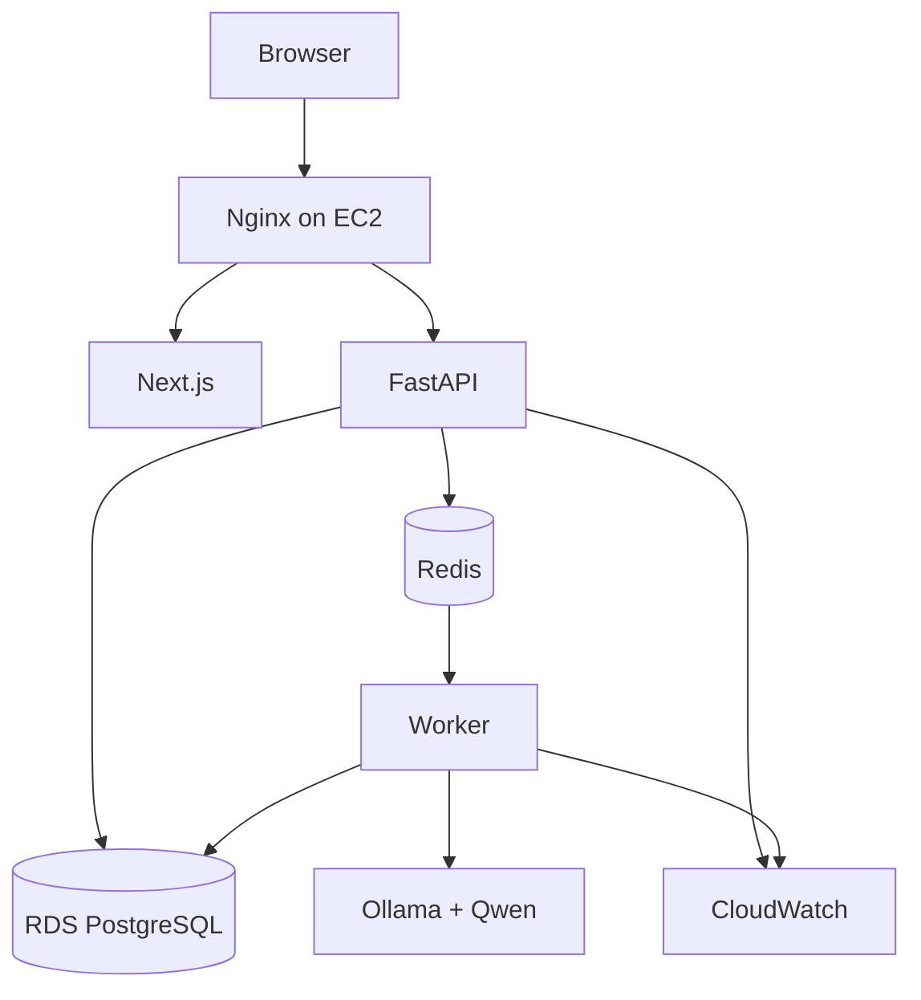

# ReviewSignal AI — Deployment
**Status:** Draft v1.1  
**Goal:** Simple AWS deployment for a solo developer.

## Documentation links
Read [`README.md`](README.md) for hierarchy and conflict rules. Product intent is
owned by [`PRD.md`](PRD.md); topology follows
[`architecture.md`](architecture.md). Runtime services host the workflows in
[`ai-pipeline.md`](ai-pipeline.md), persist the entities in [`data-model.md`](data-model.md),
serve [`api-spec.md`](api-spec.md), and emit signals consumed by
[`evaluation.md`](evaluation.md).

**Split out of this document:** [`operations.md`](operations.md) holds what were sections 17-31.
Numbering here keeps its gaps so existing `§N` citations resolve.

## 1. Philosophy
Use the simplest infrastructure that runs reliably, supports background jobs, protects the database, is easy to debug, and has a clear growth path. MVP does not use Kubernetes.

## 2. Environments
Required: `local`, `production`. Add `staging` only when release complexity justifies it.

## 3. Local Development
```text
MacBook
├─ Next.js
├─ FastAPI
├─ PostgreSQL
├─ Redis
├─ Worker
└─ Ollama
```
Docker Compose runs application/infrastructure services. Ollama may run directly on macOS for better hardware acceleration.

## 4. Production Topology


## 5. AWS Services
Required MVP: EC2, RDS PostgreSQL, CloudWatch.  
Optional when useful: S3, SSM Parameter Store/Secrets Manager, Route 53, ACM.

## 6. EC2 Services
Docker Compose may run: `nginx`, `web`, `api`, `redis`, `worker`, `ollama`. PostgreSQL stays on RDS.

## 7. Container Responsibilities
- `web`: Next.js production server.
- `api`: FastAPI.
- `worker`: consumes async jobs.
- `redis`: queue/cache.
- `ollama`: reasoning runtime where feasible.
- `nginx`: reverse proxy/TLS termination if used.

## 8. Network
Public: HTTPS 443; optional HTTP 80 redirect.  
Private: RDS, Redis, Ollama, internal service ports.  
Never expose PostgreSQL, Redis, or Ollama directly to the Internet.

## 9. Domain & TLS
Recommended:
```text
reviewsignal.example.com → Nginx → Next.js/FastAPI
```
Production is HTTPS-only. Keep TLS setup simple; Nginx + Let's Encrypt is acceptable for MVP.

## 10. Secrets
Never commit Google OAuth secrets/tokens, DB password, session secret, or AWS credentials.
Use environment variables or SSM/Secrets Manager.

## 11. Environment Variables
Typical:
```text
APP_ENV
DATABASE_URL
REDIS_URL
GOOGLE_CLIENT_ID
GOOGLE_CLIENT_SECRET
GOOGLE_REDIRECT_URI
OLLAMA_BASE_URL
OLLAMA_MODEL
EMBEDDING_MODEL
BENCHMARK_PATH
SESSION_SECRET
OPERATOR_PASSWORD
CREDENTIAL_ENCRYPTION_KEY
```
Never expose server secrets to the Next.js client bundle.

## 12. RDS PostgreSQL
Use RDS for managed backups/recovery. Configure private access, automated backups, restricted security group, and SSL where available.

## 13. Redis
MVP can run Redis on EC2 because workload is small. Migrate to ElastiCache only when reliability/scale justifies it.

## 14. AI Inference
Development: Ollama on MacBook.  
Initial production: Ollama on EC2 if performance is acceptable.  
Growth path: private dedicated GPU/vLLM host.
Application code uses `OLLAMA_BASE_URL`, not a hard-coded host.

## 15. GPU Strategy
Do not buy an always-on GPU before measuring. Prototype locally, benchmark latency, estimate daily volume, deploy the cheapest acceptable option, then split inference only if needed.

## 16. Docker Compose
Conceptual services:
```yaml
services:
  nginx:
  web:
  api:
  redis:
  worker:
  ollama:
```
RDS is external.

## 20. Logging
Moved to [`operations.md`](operations.md) §4. The heading stays so existing
`deployment.md` §20 citations still resolve.

## 22. Health Checks
Moved to [`operations.md`](operations.md) §6. The heading stays so existing
`deployment.md` §22 citations still resolve.

## 29. Failure Scenarios
Moved to [`operations.md`](operations.md) §13. The heading stays so existing
`deployment.md` §29 citations still resolve.

## 32. Summary
```text
EC2: Nginx + Next.js + FastAPI + Redis + Worker + Ollama
RDS: PostgreSQL
CloudWatch: logs + alerts
```
This is intentionally simple, maintainable, and upgradeable.
