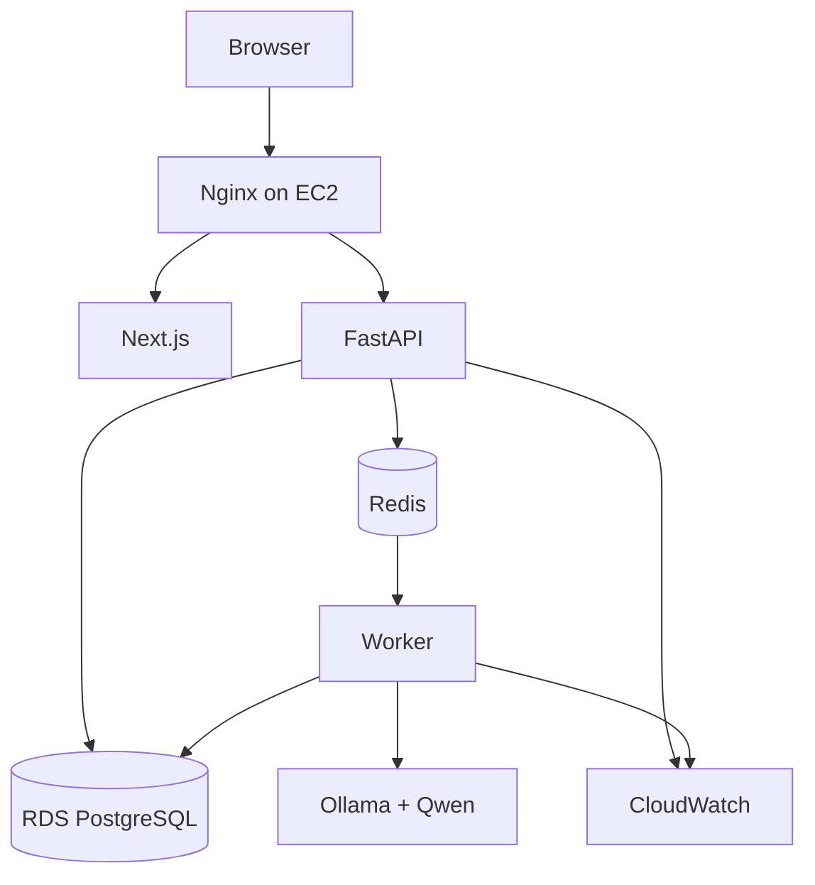

# ReviewSignal AI — Deployment
**Status:** Draft v1.1  
**Goal:** Simple AWS deployment for a solo developer.

## Documentation links
Read [`README.md`](README.md) for hierarchy and conflict rules. Product intent is
owned by [`PRD.md`](PRD.md); topology follows
[`architecture.md`](architecture.md). Runtime services host the workflows in
[`ai-pipeline.md`](ai-pipeline.md), persist the entities in [`data-model.md`](data-model.md),
serve [`api-spec.md`](api-spec.md), and emit signals consumed by
[`evaluation.md`](evaluation.md).

## 1. Philosophy
Use the simplest infrastructure that runs reliably, supports background jobs, protects the database, is easy to debug, and has a clear growth path. MVP does not use Kubernetes.

## 2. Environments
Required: `local`, `production`. Add `staging` only when release complexity justifies it.

## 3. Local Development
```text
MacBook
├─ Next.js
├─ FastAPI
├─ PostgreSQL
├─ Redis
├─ Worker
└─ Ollama
```
Docker Compose runs application/infrastructure services. Ollama may run directly on macOS for better hardware acceleration.

## 4. Production Topology


## 5. AWS Services
Required MVP: EC2, RDS PostgreSQL, CloudWatch.  
Optional when useful: S3, SSM Parameter Store/Secrets Manager, Route 53, ACM.

## 6. EC2 Services
Docker Compose may run: `nginx`, `web`, `api`, `redis`, `worker`, `ollama`. PostgreSQL stays on RDS.

## 7. Container Responsibilities
- `web`: Next.js production server.
- `api`: FastAPI.
- `worker`: consumes async jobs.
- `redis`: queue/cache.
- `ollama`: reasoning runtime where feasible.
- `nginx`: reverse proxy/TLS termination if used.

## 8. Network
Public: HTTPS 443; optional HTTP 80 redirect.  
Private: RDS, Redis, Ollama, internal service ports.  
Never expose PostgreSQL, Redis, or Ollama directly to the Internet.

## 9. Domain & TLS
Recommended:
```text
reviewsignal.example.com → Nginx → Next.js/FastAPI
```
Production is HTTPS-only. Keep TLS setup simple; Nginx + Let's Encrypt is acceptable for MVP.

## 10. Secrets
Never commit Google OAuth secrets/tokens, DB password, session secret, or AWS credentials.
Use environment variables or SSM/Secrets Manager.

## 11. Environment Variables
Typical:
```text
APP_ENV
DATABASE_URL
REDIS_URL
GOOGLE_CLIENT_ID
GOOGLE_CLIENT_SECRET
GOOGLE_REDIRECT_URI
OLLAMA_BASE_URL
OLLAMA_MODEL
EMBEDDING_MODEL
SESSION_SECRET
OPERATOR_PASSWORD
CREDENTIAL_ENCRYPTION_KEY
```
Never expose server secrets to the Next.js client bundle.

## 12. RDS PostgreSQL
Use RDS for managed backups/recovery. Configure private access, automated backups, restricted security group, and SSL where available.

## 13. Redis
MVP can run Redis on EC2 because workload is small. Migrate to ElastiCache only when reliability/scale justifies it.

## 14. AI Inference
Development: Ollama on MacBook.  
Initial production: Ollama on EC2 if performance is acceptable.  
Growth path: private dedicated GPU/vLLM host.
Application code uses `OLLAMA_BASE_URL`, not a hard-coded host.

## 15. GPU Strategy
Do not buy an always-on GPU before measuring. Prototype locally, benchmark latency, estimate daily volume, deploy the cheapest acceptable option, then split inference only if needed.

## 16. Docker Compose
Conceptual services:
```yaml
services:
  nginx:
  web:
  api:
  redis:
  worker:
  ollama:
```
RDS is external.

## 17. Deployment Flow
```text
git push
→ tests
→ build
→ deploy EC2
→ migrations
→ restart containers
→ health check
```
GitHub Actions can automate this later.

## 18. Database Migrations
Use Alembic. Production order: backup/check → migrate → start API/worker → health check. Never edit production schema manually.

## 19. Scheduled Jobs
Daily Google sync can use worker scheduler or cron initially. EventBridge is a later option. Prefer the simplest mechanism that is visible and easy to debug.

## 20. Logging
Log timestamp, service, level, request/job ID, event, error. Never log secrets or OAuth tokens.

## 21. CloudWatch
Send API logs, worker logs, sync/model failures, and system metrics.
Minimum alerts: repeated sync failure, API unavailable, high disk usage, repeated worker failure, RDS storage warning.

## 22. Health Checks
Required:
```text
GET /api/v1/health
GET /api/v1/system/status
```
Check API, PostgreSQL, Redis, worker freshness; report Ollama/model health separately.

## 23. Backups
Use RDS automated backups. Keep deployment config in Git except secrets. Take manual snapshots before risky migrations/releases when appropriate.

## 24. Restore
```text
restore RDS snapshot
→ update connection
→ run required migrations
→ restart API/worker
→ verify health
```
Test restore procedures periodically.

## 25. Google OAuth
```text
Settings → Connect Google → OAuth → callback → protected token storage
```
Only backend handles OAuth secrets. Tokens are encrypted with
`CREDENTIAL_ENCRYPTION_KEY` and stored in `source_credentials`
([`data-model.md`](data-model.md) §18); the key itself stays in the environment.

## 26. Security Groups
EC2: allow 80/443 from Internet; SSH only from trusted IP if used.  
RDS: allow PostgreSQL only from app EC2/security group.

## 27. Updates
Regularly patch OS, Docker, Python/Node dependencies, Ollama. Model changes require benchmark evaluation before promotion.

## 28. Cost Control
Primary costs: EC2, RDS, possible GPU, storage/log retention.
Principles: one EC2 initially, small RDS, no always-on GPU unless justified, bounded log retention, scale from measurements.

## 29. Failure Scenarios
- Google API unavailable: retry, retain last successful sync, show warning.
- Worker crash: container restart + recoverable job.
- Ollama unavailable: retry AI job; existing dashboard remains usable.
- RDS unavailable: fail health check and pause write-dependent jobs.

## 30. Scaling Triggers
Split services only when API latency, queue backlog, model saturation, memory contention, or availability requirements justify it.

## 31. Future AWS Path
Possible: EC2→ECS/Fargate, Redis→ElastiCache, cron→EventBridge, queue→SQS, Ollama→dedicated GPU/vLLM. None are required for Maple Photo MVP.

## 32. Summary
```text
EC2: Nginx + Next.js + FastAPI + Redis + Worker + Ollama
RDS: PostgreSQL
CloudWatch: logs + alerts
```
This is intentionally simple, maintainable, and upgradeable.
