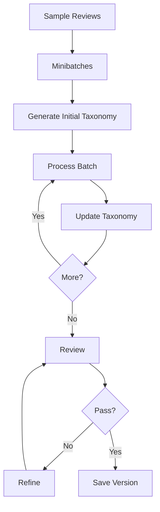

# ReviewSignal AI — Taxonomy Pipeline
**Status:** Draft v1.1  
**Scope:** Discovering, reviewing, accepting, versioning, and rebuilding the taxonomy.

## Documentation links
Read [`README.md`](README.md) for hierarchy and conflict rules. This workflow runs inside the pipeline owned by
[`ai-pipeline.md`](ai-pipeline.md), writes the tables in
[`data-model.md`](data-model.md), and is scored by
[`taxonomy-insight-evaluation.md`](taxonomy-insight-evaluation.md).

## 1. Taxonomy Goal
No business categories are seeded manually. The taxonomy should be grounded, hierarchical, concise, minimally overlapping, and operationally meaningful.

## 2. LangGraph State
```python
class TaxonomyState(TypedDict):
    reviews: list
    batches: list
    batch_index: int
    current_taxonomy: dict
    previous_taxonomy: dict | None
    review_feedback: dict | None
    iteration_count: int
    status: str
```

## 3. Taxonomy Workflow

Bound refinement to roughly 3–5 iterations.

## 4. Taxonomy Node
```json
{"name":"Service","description":"Customer feedback about service delivery.","children":[{"name":"Wait Time","description":"Feedback about delays or slow service.","children":[]}]}
```
Descriptions are required so classification uses semantic meaning, not label names alone.

## 5. Taxonomy Review
Check duplicate categories, semantic overlap, missing themes, over-broad/over-narrow nodes, unsupported nodes, and poor hierarchy.
Example:
```json
{"accepted":false,"issues":[{"type":"overlap","categories":["Staff Friendliness","Staff Attitude"],"recommendation":"Consider a shared parent."}]}
```

## 6. Automatic Acceptance
A candidate taxonomy becomes active automatically once the quality gate passes. The user can edit it later.

## 7. Rebuild Signals
Do not rebuild daily. Consider: enough new reviews, rising low-confidence rate, repeated unmatched reviews, embedding novelty, manual rebuild, or evaluation regression.

## 8. Novelty Signal
```python
novelty = 1 - max_cosine_similarity(review_embedding, category_embeddings)
```
Novelty contributes evidence for rebuild; it never creates a category automatically.

## 9. Taxonomy Change
```text
new version
→ activate
→ reclassify historical reviews
→ recompute analytics
→ re-evaluate affected insights
```
